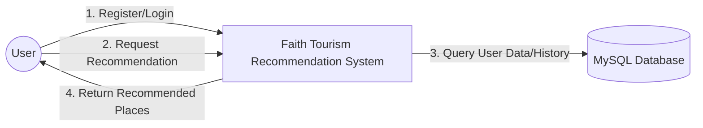

# System Architecture for Thesis (Chapter 3)

นำโค้ดด้านล่างนี้ไปใช้ใน [Mermaid Live Editor](https://mermaid.live/) เพื่อเซฟเป็นรูปภาพความละเอียดสูง (PNG/SVG) สำหรับใส่ในเล่มวิทยานิพนธ์ได้เลยครับ

## Context Diagram (ภาพรวมระบบ)



## Data Flow Diagram (DFD) / System Architecture

```mermaid
flowchart TD
    %% Define Styles
    classDef client fill:#e1f5fe,stroke:#01579b,stroke-width:2px;
    classDef server fill:#fff3e0,stroke:#ff6f00,stroke-width:2px;
    classDef storage fill:#e8f5e9,stroke:#2e7d32,stroke-width:2px;
    classDef model fill:#f3e5f5,stroke:#7b1fa2,stroke-width:2px;

    subgraph Client_Side ["Client Side (User Layer)"]
        UI[Web Application / Frontend]:::client
    end

    subgraph Server_Side ["Server Side (API Layer)"]
        API[FastAPI Gateway]:::server
        Auth[Authentication Service]:::server
        RecSys[Recommendation Engine]:::server
    end

    subgraph Data_Layer ["Data Layer (Storage & Model)"]
        DB[(MySQL Database)]:::storage
        Pickle[UBCF Model (.pkl)]:::model
    end

    %% Connections
    UI -- "1. HTTP Request (JSON)" --> API
    API -- "2. Validate User" --> Auth
    Auth -- "3. Check Credentials" --> DB
    
    API -- "4. Request Recommendation(user_id)" --> RecSys
    RecSys -- "5. Load Similarity Matrix" --> Pickle
    RecSys -- "6. Get User History" --> DB
    
    RecSys -- "7. Compute Scores" --> RecSys
    RecSys -- "8. Filter & Rank" --> RecSys
    
    RecSys -- "9. List of Places" --> API
    API -- "10. JSON Response" --> UI

```
